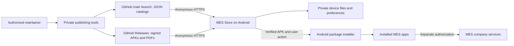

# MES Store

MES Store is a native Android app marketplace for MES workplace tools. It provides app discovery, verified APK downloads, update checks, and operational tutorials without requiring Google Play services or a separate store backend.

This public repository is the **distribution and content repository**. It contains catalogs, documentation, and release assets. Android application source code, signing keys, and publisher credentials are maintained separately. Public downloads do not grant access to MES company services: each MES application still enforces its own pairing and authorization.

## Download and release status

**Public download: [MES Store 1.2.10](https://github.com/huangxuewu/mes-app-releases/releases/download/mes-store-v1.2.10/mes-store-1.2.10.apk)** · Android 9 / API 28 or newer

The following snapshot was verified on **September 17, 2026**. The [live app catalog](catalog.json) is the source of truth for offered versions.

| Component | Version | Version code | Distribution status |
| --- | --- | --- | --- |
| MES Store | 1.2.10 | 16 | Published and listed in the live catalog |
| Dispatcher | 1.1.0 | 4 | Published and listed in the live catalog |
| SignPad | 1.6.2 | 12 | Published and listed in the live catalog |
| Time Punch | 1.2.0 | 7 | Published and listed in the live catalog |
| Earlier MES Store preview | 1.2.5 | 11 | Superseded by 1.2.7; was never publicly released |

Version codes belong to individual application packages; matching codes across different apps have no significance. Updating this README does not publish an APK or change the catalog.

MES Store 1.2.10 gives Dispatcher and Time Punch distinct Featured artwork, uses Dispatcher's actual launcher icon, and reduces the bottom navigation height. Featured focuses on workplace apps; MES Store remains under Apps. Download and installation buttons display measured percentage progress. Android confirmation, cancellation, retry, and recovery after a store process restart are supported.

### First installation

1. Download the published MES Store APK on the Android device.
2. Open the APK. If requested, allow the browser or file manager used for this initial installation to install apps.
3. Open MES Store and select an app from Featured or Apps.
4. Download the app, then choose **Install now** when ready. Enable Android's **Allow from this source** permission for MES Store when prompted.
5. Complete Android's installation confirmation. Finish work in the target app before updating it.

Install updates over the existing application. Keeping the package ID and signing identity compatible allows Android to retain app data. Do not uninstall SignPad to bypass a signing-key mismatch; contact the administrator.

### Dispatcher and SignPad updates

[Dispatcher 1.1.0](https://github.com/huangxuewu/mes-app-releases/releases/download/dispatcher-v1.1.0/dispatcher-1.1.0.apk) adds desktop MES pairing, dock loading, native Android PDF printing, WebRTC transfers with socket fallback, and refined scheduling and search. These features require the updated MES backend and paired desktop MES. Printer availability depends on installed Android print services.

[SignPad 1.6.2](https://github.com/huangxuewu/mes-app-releases/releases/download/signpad-v1.6.2/signpad-1.6.2.apk) adds compact shipment confirmations, clearer carrier badges and selection states, and completed loading progress from MES.

### Time Punch for Android tablets

[Download Time Punch 1.2.0](https://github.com/huangxuewu/mes-app-releases/releases/download/time-punch-v1.2.0/time-punch-1.2.0.apk), or refresh the Apps tab in MES Store. This dedicated punch app provides six-digit employee PIN entry, camera photos, Start Work, Start Break, End Break, and End Work. Version 1.2.0 uses larger vertically arranged actions, localized dates and labels, a subtle animated login background, and the updated transparent person-and-clock icon shown in MES Store 1.2.10. The circular front-camera preview, round keypad, light gray company footer, and portrait layout remain. Time Punch requires Android 9 or newer and a front-facing camera.

On first launch, allow camera access, name the tablet station, and enter the existing MES station access code supplied by your administrator. The production MES server address is prefilled. Employees then use their existing PINs. Wait for **Punch recorded** before leaving; an interrupted punch remains encrypted on the tablet and retries with the same command ID. Keep the app open while awaiting confirmation. New PIN sessions require a live MES connection.

## Contents

- [Architecture](#architecture)
- [Application interface](#application-interface)
- [App catalog format](#app-catalog-format)
- [Download verification and installation](#download-verification-and-installation)
- [Automatic updates](#automatic-updates)
- [Tutorials and illustrated guides](#tutorials-and-illustrated-guides)
- [Data storage and offline behavior](#data-storage-and-offline-behavior)
- [Network behavior and permissions](#network-behavior-and-permissions)
- [Maintainer build and publishing workflow](#maintainer-build-and-publishing-workflow)
- [Validation and troubleshooting](#validation-and-troubleshooting)
- [Current limits](#current-limits)

## Architecture

The store uses static JSON files as indexes and GitHub Releases as binary storage. There is no separate SQL database, store account service, or custom API server in the current implementation.



### Public repository layout

| Location | Purpose |
| --- | --- |
| [README.md](README.md) | Installation instructions and technical reference |
| [catalog.json](catalog.json) | App identity, offered versions, release notes, asset URLs, and verification metadata |
| [tutorials.json](tutorials.json) | Tutorial article text, illustrated page references, and PDF verification metadata |
| [Releases](https://github.com/huangxuewu/mes-app-releases/releases) | Signed APKs, original PDF guides, and SHA-256 checksum files |

Catalog endpoints used by the app:

```text
https://raw.githubusercontent.com/huangxuewu/mes-app-releases/main/catalog.json
https://raw.githubusercontent.com/huangxuewu/mes-app-releases/main/tutorials.json
```

Release URL conventions:

```text
https://github.com/huangxuewu/mes-app-releases/releases/download/<app-slug>-v<version>/<app-slug>-<version>.apk
https://github.com/huangxuewu/mes-app-releases/releases/download/<tutorial-tag>/<guide-name>.pdf
```

Adding a compatible app entry or tutorial does not require rebuilding MES Store. Changes to the catalog schema, host restrictions, or application behavior may require a new store version.

### Android implementation

| Component in the private source project | Responsibility |
| --- | --- |
| `MainActivity` | Four tabs, app details, article content, settings, and foreground installer handoff |
| `StoreApplication` | App catalog loading, serialized APK transfer/verification, cached download state, and UI callbacks |
| `Catalog` | App JSON validation and install/update/open state selection |
| `ApkVerifier` | File, package, version, SDK, and signing-certificate checks |
| `ApkProvider` | Read-only, URI-granted access to a selected APK for Android's installer |
| `UpdateSettings` / `UpdateJobService` | Persistent preferences and scheduled background update checks |
| `TutorialCatalog` / `TutorialRepository` | Article validation, catalog caching, and verified PDF downloads |
| `TutorialReaderActivity` / `PdfPageView` | Native PDF page rendering, navigation, pinch zoom, and panning |
| `TutorialIllustrations` | Renders article illustrations near the viewport and releases offscreen bitmaps |

Network work and PDF rendering run on worker threads; UI changes are posted to the main thread. PDF pages are rendered with Android `PdfRenderer`; no browser-based PDF viewer or separately installed PDF app is required.

## Application interface

| Tab | Behavior |
| --- | --- |
| **Featured** | Large illustrated cards introduce available apps and open their detail pages. |
| **Apps** | Full app catalog, text search, and All / Updates / Installed filters. |
| **Tutorial** | Articles explaining MES workflows, with illustrated PDF guides. |
| **Settings** | Automatic check/download preferences, manual update check, installation permission, and APK download cleanup. |

Pull down at the top of Featured, Apps, or Tutorial to refresh the corresponding catalog. A spinner follows the refresh request. Normal article and app-detail scrolling does not trigger refresh. The list also exposes a **Refresh list** accessibility action. Settings retains **Check for updates now**.

When Android reports that the default network has no validated internet connection, the header reads **MES STORE - offline** and the top-right store icon becomes grayscale. The normal label and icon return automatically when connectivity recovers, even if automatic update checks are disabled. The old saved-catalog banner is removed; cached content remains usable. This status reflects device internet connectivity, not whether GitHub has returned a successful catalog response.

The app detail action depends on Android compatibility and installed version:

| Condition | Result |
| --- | --- |
| Device API is below the app's `minSdk` | Incompatible; download/install action disabled |
| Package is not installed | Get app |
| Installed version code is lower than the catalog version | Update |
| Verified update is cached | Install now |
| Installed version code equals or exceeds the catalog version | Open; MES Store's own detail page shows Installed |

A device running a newer preview is not offered a downgrade to the older public catalog version.

## App catalog format

`catalog.json` is UTF-8 JSON with `schemaVersion: 1` and an `apps` array. Each `packageName` must occur only once. Example using the published MES Store 1.2.7 entry:

```json
{
  "schemaVersion": 1,
  "apps": [
    {
      "packageName": "com.advancebusinesscare.mes.appstore",
      "versionCode": 13,
      "versionName": "1.2.7",
      "minSdk": 28,
      "certificateSha256": "157a282e203d93067767866c2fd253c4e93fe116ff35768b07ac4928801863da",
      "sha256": "f428e601db327db792732fb817f95ce63b2ccf1f810297425289fb05e3ba1725",
      "size": 2889661,
      "name": "MES Store",
      "description": "Your MES apps and updates, together in one place.",
      "releaseNotes": "MES Store 1.2.7\n\nFixed an Android 9 compatibility issue that could incorrectly report \"The APK has an unexpected signing certificate\" for a valid download. MES Store now requests the certificate information Android 9 requires while preserving all certificate, checksum, package, and version checks.\n\nIf an older MES Store cannot install this update because of that message, download this official APK in a browser and install it over the existing MES Store. Do not uninstall the app. The package ID and release signing key are unchanged.\n\nIncludes the offline header status, inline tutorial illustrations, full-screen image viewing, remaining reading time, and interface improvements from 1.2.6. App installation still requires Android confirmation.",
      "apkUrl": "https://github.com/huangxuewu/mes-app-releases/releases/download/mes-store-v1.2.7/mes-store-1.2.7.apk"
    }
  ]
}
```

| Field | Meaning |
| --- | --- |
| `name`, `description` | Display name and short description |
| `packageName` | Android application ID; identifies an app across releases |
| `versionCode` | Positive integer used to decide whether an update is newer |
| `versionName` | User-visible version string; also checked against the APK |
| `minSdk` | Minimum Android API level required by the APK |
| `apkUrl` | HTTPS APK asset URL under this repository's release download path |
| `sha256` | SHA-256 of the complete APK bytes |
| `certificateSha256` | SHA-256 of the APK signing certificate; distinct from the file checksum |
| `size` | Exact APK length in bytes |
| `releaseNotes` | Plain-text changes shown on the detail page |

Current validation limits include a 1 MiB catalog response, at most 100 app entries, APK sizes from 1 byte through 512 MiB, valid package IDs, 64-character hexadecimal hashes, and bounded display text. Names and version names are limited to 80 characters, descriptions to 2,000, and release notes to 20,000. Unknown schema versions and duplicate package IDs are rejected.

Initial APK URLs must use `https://github.com/huangxuewu/mes-app-releases/releases/download/`, end in `.apk`, and have no user information, explicit port, query, or fragment. Publishers should generate verification fields from the signed artifact rather than type them manually.

## Download verification and installation

The normal sequence is:

1. Read the remote catalog, or retain the last valid local catalog if the request fails.
2. Determine the installed package version with Android's package manager.
3. Stream the chosen APK into an internal `<sha256>.part` file, enforcing the expected length.
4. Check exact file size and SHA-256.
5. Read APK metadata and match package ID, version code, version name, and minimum SDK to the catalog.
6. Require one current signer and match its certificate fingerprint to `certificateSha256`.
7. If the app is installed, require a strictly newer version and signing-certificate compatibility with that installation.
8. Rename the verified file to `<sha256>.apk` and remember that it is ready.
9. After the user chooses Install now, reverify the cached APK and stage it in an Android install session while showing percentage progress in the action button.
10. Android performs final installation validation and requests confirmation.

MES Store 1.2.7 requests both `GET_SIGNING_CERTIFICATES` and `GET_SIGNATURES` when parsing a downloaded APK. Android 9 only collects archive certificates when the legacy flag is also present. Verification still reads the current signer from `signingInfo.apkContentsSigners`; the extra flag does not bypass any checks. Missing certificate information has a separate error from a real signer mismatch.

The provider is non-exported and accepts only a single filename matching a SHA-256 digest plus `.apk`. It rejects traversal-style paths and write access. Its authority is `com.advancebusinesscare.mes.appstore.apks`.

Interrupted downloads restart when retried; byte-range resume is not implemented. Failed verification removes the candidate file and its ready marker. A successfully cached APK normally survives a store process restart, but Android may evict cache files to reclaim storage.

### Trust model

The GitHub repository and the maintainer's publishing credentials are the catalog trust authority. The catalog is delivered over HTTPS but is **not independently signed**. Checksums detect a file that differs from its catalog entry; they do not make a compromised catalog trustworthy. Protecting repository write access and signing keys remains essential.

The publishing tool checks APK signatures with `apksigner`; the client checks hashes and signing identity before handing the APK to Android. Android is the final installation authority. The publishing workflow currently rejects changes to an existing app's catalog signing certificate, so signing-key rotation requires a separately designed migration.

## Automatic updates

| Preference | Default | Behavior |
| --- | --- | --- |
| Automatic update checks | On | Checks on a fresh store launch and schedules a periodic background job |
| Download updates automatically | Off | When enabled, prepares newer compatible versions of already-installed catalog apps |
| Unmetered connections only | On | Limits automatic downloads to Wi-Fi or another network Android reports as unmetered |

The persisted Android `JobScheduler` job uses ID `4101` and a requested period of 24 hours. This is not an exact daily appointment: Android can delay work based on system scheduling and connectivity. If automatic downloads require an unmetered network, the scheduled job itself uses that network constraint; otherwise it accepts any available network.

Scheduled work uses the network assigned to the job. Cancellation stops the active background transfer, and download/network preferences are checked again during automatic transfers. Disabling automatic checks cancels the scheduled job. Foreground catalog checks can also prepare updates when the automatic-download preferences permit them.

Automatic downloads do not install apps, launch an installer from the background, or interrupt another app's workflow. There are currently no background update notifications. Users open MES Store and choose when to install. Manual checks remain available when automatic checking is disabled.

MES Store can update itself because its own package appears in the remote catalog. The same verification and Android confirmation flow applies. The APK's bundled fallback catalog does not need to contain the store's own APK metadata, avoiding a circular checksum dependency.

## Tutorials and illustrated guides

The first article is **How to use SignPad**, covering picking, labeling, inspection, inspector signing, loading, shipper/driver signatures, and BOL printing.

[Download the original 11-page illustrated guide](https://github.com/huangxuewu/mes-app-releases/releases/download/tutorial-signpad-daily-workflow-v1/signpad-daily-workflow.pdf). The examples use training data; scan current paperwork and verify the load, DC, and PO in actual work.

### Tutorial behavior by release

| Capability | Earlier 1.2.4 | Current 1.2.7 |
| --- | --- | --- |
| Native step-by-step article | Yes | Yes |
| Illustration access | Open illustrated guide / per-section page buttons | Illustrations displayed within each article section; tap an image to enlarge |
| Viewer | Dedicated PDF reader | Immersive full-screen image view with controls that can be hidden by tapping |
| Zoom and pan | Pinch, drag, double-tap; no plus/minus toolbar | Pinch, drag, double-tap; no plus/minus toolbar |
| Header | SIGNPAD GUIDE | Estimated remaining reading time |
| PDF fetching | On opening the illustrated guide | Automatically on opening the article if the verified PDF is not saved |
| Offline illustrations | After the first successful PDF download | After the first successful PDF download |

The reader estimates reading time at 200 words per minute plus 12 seconds per illustration, then reduces the estimate according to article scroll progress. It is a reading estimate, not a countdown or a measurement of warehouse task duration. Returning from the enlarged image preserves the article's reading position.

Since 1.2.6, only illustrations near the viewport are rasterized; offscreen bitmaps are released. PDF rendering runs on a worker thread and page handles are closed after use. The full-screen reader renders the selected page at a higher resolution and supports previous/next navigation and a page selector.

### Tutorial catalog format

`tutorials.json` contains `schemaVersion: 1` and an `articles` array. Each article includes:

| Field | Meaning |
| --- | --- |
| `id` | Unique, stable lowercase article ID using letters, digits, and hyphens |
| `title`, `subtitle`, `description` | Article discovery and heading text |
| `updated` | Date string in `YYYY-MM-DD` format |
| `introduction` | Instructions shown before the first section |
| `pdfUrl` | Original PDF asset URL in this repository's releases |
| `sha256`, `size` | Exact PDF checksum and byte length |
| `pageCount` | Expected number of pages, verified when the PDF opens |
| `sections` | Ordered list of sections with `title`, one-based `page`, `steps`, and optional `note` |

Example section:

```json
{
  "title": "Use the picking summary",
  "page": 1,
  "steps": [
    "Match the red LOAD number to the load you are working on.",
    "For picking, scan the bottom-left barcode under Prepared By.",
    "After labeling every DC, use the barcode under Checked By for inspection."
  ],
  "note": "Picking and inspection use the summary. Labeling and loading use the separate DC slip."
}
```

The full production article and PDF metadata are in [tutorials.json](tutorials.json). The current PDF is 945,396 bytes with SHA-256 `4a957903302fce6c1e2ea545aca5f7a32eb385dcb1256c2df42d09a9ad214716`.

The tutorial index response is limited to 2 MiB and 100 articles. Each article supports 1–200 pages, 1–200 sections, and 1–20 steps per section. PDFs are limited to 25 MiB. Page references must fall within the declared page count; text lengths, IDs, and hashes are validated. Initial PDF URLs must be HTTPS release download URLs in this repository, ending in `.pdf`, without query strings or fragments.

Tutorial refresh is separate from scheduled APK update checks. Entering the Tutorial tab refreshes its index; pull-to-refresh requests another check. Failed requests keep the last valid saved articles or the bundled fallback.

## Data storage and offline behavior

The app uses ordinary private Android files and SharedPreferences. It does not use a local SQL database.

| Data | Location | Lifetime / behavior |
| --- | --- | --- |
| App catalog | GitHub `main/catalog.json` | Shared list of currently offered APK versions |
| Tutorial catalog | GitHub `main/tutorials.json` | Shared article text and PDF metadata |
| APK/PDF assets | GitHub Releases | Public download files; publishers treat released bytes as immutable |
| Saved app catalog | App-private `files/catalog.json` | Last successfully parsed catalog |
| Saved tutorial catalog | App-private `files/tutorials.json` | Last successfully parsed tutorial index |
| APK downloads | App-private `cache/apks/<sha256>.apk` | Verified installation candidates; Android may evict cache |
| In-progress APK downloads | App-private `cache/apks/<sha256>.part` | Temporary transfer files; failed transfers are discarded |
| Saved PDF guides | App-private `files/tutorial-pdfs/<sha256>.pdf` | Persist for offline reading; size and hash are checked before opening |
| In-progress PDFs | App-private `files/tutorial-pdfs/<sha256>.part` | Temporary files renamed only after verification |
| Update settings | App-private `shared_prefs/updates.xml` | `autoCheck`, `autoDownload`, `unmeteredOnly`, `lastCheck`, and verified-download hashes |
| Screen and reading position | Activity saved state and in-memory UI state | Preserved during normal navigation and supported activity restoration; not a cloud-synced reading history |

These paths are relative to Android's private application directory, typically `/data/user/0/com.advancebusinesscare.mes.appstore/` for the primary user. They are not files exposed in shared phone storage.

Catalogs are bundled in the APK for first-launch fallback. Articles can therefore be readable before their PDF is downloaded, but illustrations require a successful initial download. Saved PDFs can be opened without connectivity. Updates require network access unless a valid APK is already cached.

**Clear downloaded files** currently clears APK downloads and their ready markers. It does not remove installed apps, their business data, saved catalogs, or tutorial PDFs. Clearing MES Store's Android app data or uninstalling the store removes its private settings/files; it does not uninstall the other MES applications. Automatic Android backup is disabled for the store.

## Network behavior and permissions

All catalog and asset requests use HTTPS. The download client checks every redirect destination against these exact hosts:

```text
github.com
raw.githubusercontent.com
release-assets.githubusercontent.com
objects.githubusercontent.com
```

The client permits at most six request attempts in a redirect chain, requires HTTP 200 for the final response, and uses a 15-second connection timeout and 30-second read timeout. Catalog checks add a timestamp query parameter and request `Cache-Control: no-cache` to reduce stale responses after publication. Invalid responses do not overwrite the last valid catalog.

The Android client downloads anonymously and contains no publisher GitHub token. It has no app-store login or upload endpoint. Its package checks are local; it does not upload an installed-app inventory. GitHub still receives ordinary network requests for its hosted content.

| Android permission | Purpose |
| --- | --- |
| `INTERNET` | Download catalogs, APKs, and PDF guides |
| `ACCESS_NETWORK_STATE` | Respect automatic-download connectivity preferences |
| `RECEIVE_BOOT_COMPLETED` | Support persisted scheduled update jobs |
| `REQUEST_INSTALL_PACKAGES` | Request user-approved Android package installation |
| `QUERY_ALL_PACKAGES` | Check installed versions for catalog package IDs that may be added remotely |

The PDF reader activity and APK provider are non-exported. The update service requires Android's `BIND_JOB_SERVICE` permission. No broad shared-storage permission is required.

## Maintainer build and publishing workflow

The following tools and source paths refer to the **private MES Store source project**. They are not included in this public distribution repository. Cloning this repository alone does not provide an Android build project.

### Toolchain and identity

| Item | Current configuration |
| --- | --- |
| Application ID | `com.advancebusinesscare.mes.appstore` |
| UI | Kotlin and native Android Views |
| Minimum SDK | 28 / Android 9 |
| Compile / target SDK | 34 / 34 |
| Java source/target compatibility | 17 |
| Android Gradle Plugin | 8.2.2 |
| Kotlin plugin | 1.9.22 |
| Gradle wrapper | 8.5 |
| Pull-to-refresh | AndroidX SwipeRefreshLayout 1.1.0 |
| Publisher runtime | Python 3.11+ and Android SDK build tools |

The MES Store release certificate fingerprint is:

```text
157a282e203d93067767866c2fd253c4e93fe116ff35768b07ac4928801863da
```

The certificate fingerprint is public metadata, not the private signing key. Each catalog app retains its own signing identity; the store does not re-sign SignPad or other apps.

### Build a candidate

Use a configured JDK and Android SDK in the private source checkout. Example PowerShell commands:

```powershell
# JAVA_HOME and ANDROID_HOME must already point to the configured toolchain.
.\gradlew.bat :app:assembleRelease :app:testDebugUnitTest :app:lintDebug
```

The output is `app/build/outputs/apk/release/app-release.apk`. Local `signing.properties` supplies the keystore path, alias, and passwords; these files and the keystore are excluded from source control. Back up signing material securely. Never regenerate a key to update an existing installation.

Keep the package ID stable, increment `versionCode` for a new distributed APK, and assign a clear `versionName`. Before distributing any candidate, verify the signature, intended source state, version, and device behavior. Debug-signed builds belong on test emulators and cannot update the release-signed phone installation in place.

### Preview and public release are separate actions

An explicitly approved phone preview can be installed with `adb install -r` using the existing release signing key. This preserves the store's private data and does not modify GitHub. A preview does not authorize a public release; builds, phone installation, and publication are performed only when explicitly requested by the owner.

Version 1.2.6 publishes the features tested in the earlier 1.2.5 phone preview and adds live offline branding. Its higher version code made the public update eligible for preview devices, but Android 9 archive-certificate parsing could block installation in older stores. Version 1.2.5 itself was never publicly released. Version 1.2.7 fixes the Android 9 parsing issue using the same package ID and signing key. Devices whose older store rejects the update need a one-time in-place installation of the official APK through the Android installer (or an explicitly approved `adb install -r`); no uninstall is needed.

### Publish an APK

First review metadata without publishing:

```powershell
python tools/publish_app.py path/to/candidate.apk `
  --name 'Your app name' `
  --description 'Short description shown in the store.' `
  --notes path/to/release-notes.txt `
  --slug your-app-slug `
  --build-tools "$env:ANDROID_HOME\build-tools\34.0.0"
```

`--prepare` writes a local `distribution/catalog.json` for review. Only an explicitly authorized run with `--publish` uploads the APK and updates the live catalog.

The publisher:

1. Uses `aapt` and `apksigner` to extract APK metadata and validate its signature.
2. Computes size, file SHA-256, and signing-certificate SHA-256.
3. Reads the latest remote catalog and preserves entries for other packages.
4. Rejects downgrades, changed certificates, and different APK bytes under an already-cataloged version code.
5. Creates a draft release and uploads the APK plus a `.sha256` sidecar.
6. Refuses to replace an existing release APK with different bytes.
7. Publishes the release and verifies the anonymous download's checksum.
8. Updates `catalog.json` using the GitHub Contents API with the existing file SHA as a precondition.

The file SHA precondition detects concurrent catalog edits. If the catalog update fails after the release was created, rerun against the latest catalog; do not overwrite the released asset. This is an ordered publication process, not a single transaction spanning release assets and repository files.

Publishing credentials are obtained from the maintainer's configured Git credential helper in memory. They are not embedded in APKs or committed to this repository.

### Add or revise a tutorial

1. Prepare the article text and its original PDF; confirm the content is intended for public distribution.
2. Compute the PDF size and SHA-256, count its pages, and map every article section to the correct one-based page number.
3. Add the article to `distribution/tutorials.json` in the private source project. Keep bundled tutorial assets synchronized for future store builds.
4. Choose a new release tag for changed PDF bytes. Keep existing public assets unchanged.
5. Review the source/destination with the tutorial publisher:

```powershell
python tools/publish_tutorial.py path/to/guide.pdf --id your-article-id
```

After publication is authorized, add `--publish`. The tool checks that the PDF bytes match the reviewed metadata, uploads the PDF and checksum, verifies the public download, and merges the selected article into the remote tutorial index using a file-SHA precondition. Other articles remain in the catalog.

Use the actual guide's page count and appropriate release description when maintaining the publishing helper; its initial release-body text was written for the 11-page SignPad training guide. New article content within schema version 1 does not require a new APK.

### Update this README

The maintained public README is mirrored in the private project's `distribution/README.md`. Its documentation upload uses a GitHub Contents API SHA precondition. Updating README content alone must not modify either catalog, create a release, or install an app.

## Validation and troubleshooting

The 1.2.7 release build passed eight JVM unit tests, six Android integration tests, three publisher tests, and Android lint. A read-only framework probe on the Android 9 phone reproduced missing certificates with the old flag and verified the expected current signer with both flags, including a match against the installed app. The signed 1.2.7 APK was installed in place and its version code 13 was confirmed. The following UI checks were completed for 1.2.6: Live offline/reconnection branding and offline startup were checked on the emulator. The tutorial smoke check exercised inline illustrations, full-screen page navigation, and offline reopening after an emulator process restart. Earlier rollout checks covered APK installation, a store self-update, scheduled downloads without silent installation, restart recovery, and pull-to-refresh.

| Check in the private project | Coverage |
| --- | --- |
| `CatalogTest` | Version selection, duplicate entries, schema, and URL/hash validation |
| `TutorialCatalogTest` | Tutorial metadata, page references, duplicate IDs, and trusted URLs |
| `StoreIntegrationTest` | Real signed APK validation, tampering/metadata rejection, provider restrictions, settings/jobs, navigation, and all 11 PDF pages |
| Python publisher tests | Catalog merge, downgrade, and signing-identity rules |
| `tools/smoke_updates.py` | Scheduled update download, no silent install, and recovery after restart |
| `tools/smoke_refresh.py` | Actual pull gestures for app/tutorial catalogs and card navigation |
| `tools/smoke_tutorial.py` | Current article/image UI, public PDF download, page navigation, and offline reading |
| `tools/smoke_offline.py` | Live offline branding, offline startup, reconnection, and absence of the old saved-catalog banner |

Android verification uses a test emulator and unchanged APK/PDF fixtures. APK verifier tests need the target app absent or an older compatible version installed. Do not run destructive emulator setup against a production phone. New Android versions and additional device models still require their own validation.

| Symptom | Explanation / action |
| --- | --- |
| MES STORE - offline and a grayscale icon | Check connectivity and access to the allowed GitHub hosts, then pull to refresh. Saved entries remain available. |
| New release does not appear | Verify that the release asset and live catalog were both published. Pull to refresh; compare `versionCode`, not only the displayed version name. |
| Newer than catalog | A preview or manually installed version is ahead of the public catalog. The store deliberately avoids downgrading it. |
| Integrity check failed | File bytes or metadata do not match. Retry; maintainers should verify the published asset and regenerate metadata from the signed APK. |
| Unexpected signing certificate on an older Android 9 store | MES Store through 1.2.6 can fail to collect archive certificates. Download the official 1.2.7 APK from this repository and install it over the existing store through Android; do not uninstall. If the error persists, contact the administrator. |
| Different signing key | The installed app and candidate have incompatible signing identities. Stop and contact the administrator; do not uninstall to force an update. |
| Install permission requested | Enable Allow from this source for MES Store, return to the detail page, and select Install now again. |
| Cached APK disappeared | Android can reclaim cache storage. Download the verified APK again. |
| Automatic download has not run | Confirm settings and the unmetered-network requirement. Android scheduling may defer the job; use a foreground check if needed. |
| Tutorial image is unavailable | The original PDF may not be downloaded yet, the network may be unavailable, or verification failed. Retry with connectivity; cached verified PDFs work offline. |
| Catalog schema needs a newer store | Install a compatible MES Store version; unsupported schema versions are rejected. |

## Current limits

- Downloads and catalogs are public. There is no company-only download authentication, per-user entitlement system, or per-device catalog targeting.
- Company business data and authorization belong to the individual MES apps/services, not this distribution repository.
- Installation requires user interaction. The store does not provide device-owner/MDM deployment or silent installation.
- There are no push notifications, staged rollout cohorts, delta APK updates, or automatic rollback. A corrective update must use a higher version code.
- Catalogs are not independently signed; repository security is part of the trust boundary.
- Released files are treated as immutable by the publishing workflow, rather than relying on a guarantee that GitHub assets can never be changed by administrators.
- Tutorial content supports structured plain-text sections and PDF page illustrations, not arbitrary HTML, video, quizzes, or cloud-synchronized reading progress.
- There is no remote inventory dashboard, analytics pipeline, or custom store server in the current code.
- The current target SDK is 34. This sideloaded distribution setup is not a statement of Google Play submission compliance.

Keep credentials, private signing keys, and real company records out of this public repository. Use the live catalogs to verify what is actually available, and keep preview features clearly separated from published releases.
